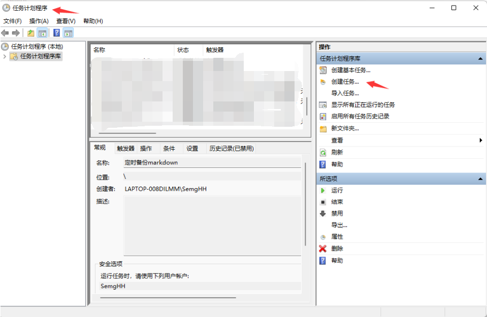
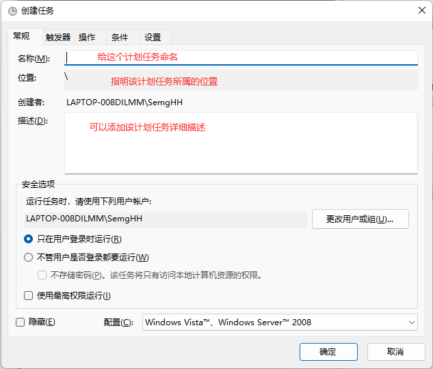
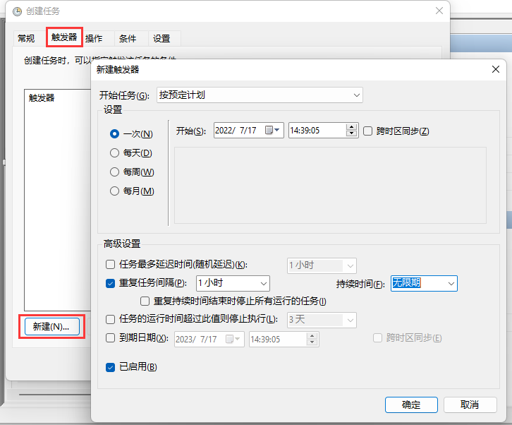
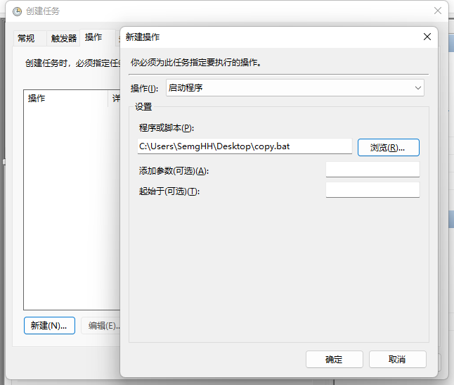
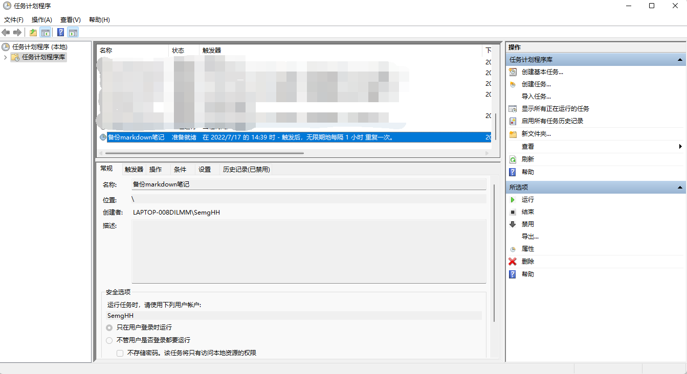

# BackupNote

使用Typora 编写笔记. 有时会突然丢失曾经的文字。
无论曾经的文字已经持久化在磁盘上多久，都有可能丢失。

目前不知道触发机制,一丢就是上千字,包括图片也会丢失。有时只会丢失图片,不会丢失文件。

所以写了一个这样的工具，自动备份<source>下的文件到<dest>下


## How to use 

目前只支持 Windows OS

首先需要 JRE 或者 JDK , 使用java -jar 命令 运行 target/copyNoteUtil.jar 即可！

`java -jar copyNoteUtil.jar <source> <dest>`


this is a example 

`java -jar copyNoteUtil.jar C:\Users\SemgHH\Desktop D:\笔记备份`


## Using Cache

自动保存上一次的<source> <dest>地址, 第二次使用可以不输入 <source> <dest>
保存地址在`C:\Users\{username}\AppData\Local\copyNote\cahce` 文件大小1KB


## Using .bat

可以使用 .bat 一键运行。(谨慎使用中文路径!会出现字符集编码问题)
推荐在有cache的情况下，使用bat脚本一键运行

```shell
  echo on
  java -jar D:\localGithubRespository\BackupNote\target\copyNoteUtil.jar
  pause


```

## Using 计划任务

使用`windows OS`的计划任务，可以实现自动定时运行 .bat 脚本


按照一下步骤定制一个 计划任务


1.打开 任务计划程序，点击创建任务




2. 创建任务并命名




3. 创建一个触发器

   


4. 新建一个操作，并引用.bat

   



5. 完成


